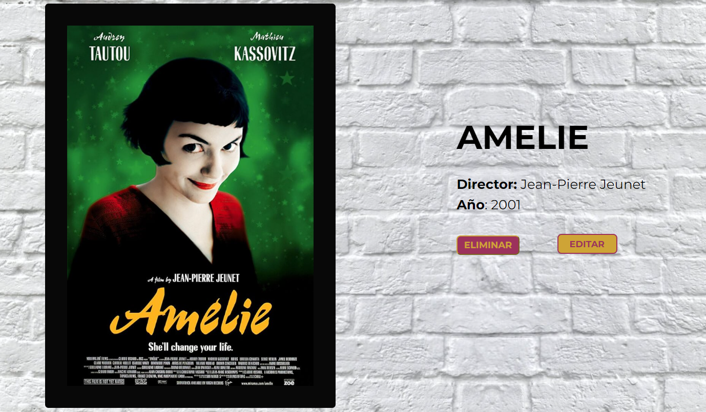

# HOLLYWOW APP

Bienvenida a nuestro proyecto HollyWow App, una aplicación web con la que puedes crear tu propia galería de pósters de cine añadiendo, editando y eliminando cualquiera de las películas que tú elijas. 
 
## CONTENIDO

- [ESTRUCTURA DEL PROYECTO](#ESTRUCTURA-DEL-PROYECTO)
- [TECNOLOGÍAS](#TECNOLOGÍAS-UTILIZADAS)
- [INSTALACIÓN](#INSTALACIÓN)
- [COLABORACIÓN DESEADA](#COLABORACIÓN-DESEADA)
- [DESARROLLADORAS](#DESARROLLADORAS)

## ESTRUCTURA DEL PROYECTO

### Página principal / Galería:

La Página principal o Galería muestra unas cards con los pósters que tenemos en nuestra base de datos. En cada una de ellas encontramos dos botones: 
 - "ELIMINAR": Nos permite borrar el póster y nos actualiza automáticamente la página mostrando el resto de cards. Este botón permite eliminar los datos mediante el método DELETE.
 - "+ INFO": Nos redirije a una página con el detalle del póster seleccionado.


La galería muestra los datos de nuestra API mediante el método GET.

### Página para añadir un nuevo póster:

En la Nav (componente presente en todas las páginas de nuestra aplicación) encontramos en la parte derecha un botón llamado "Añadir póster":


Al hacer clic en ese botón, nos redirije a nuestro formulario de "Añade tu póster":


Una vez rellenados todos los campos y pulsando el botón de la parte inferior del formulario "Añadir", nos redirijirá automáticamente a nuestra página principal y nos mostrará la galería con el nuevo póster.

### Página de detalle:

Para acceder al detalle de un póster se debe hacer clic en el botón "+ info" de la card. 

Dentro de esta, nos mostrará los datos de "imagen" y "nombre" del póster y, además, los datos extra de "director" y "año". También están los dos botones de "EDITAR" y "ELIMINAR" (hacienco clic en este último, también podríamos eliminar el póster y automáticamente volver a la página principal).



Esta página permite visualizar los datos de nuestra API mediante el método GET (GetOnePoster).

### Página de Editar:

Se accede desde la página detalle del póster que queremos modificar y pulsando el botón "Editar". Haciendo clic en ese botón, nos redirije a nuestro formulario de "Edita tu póster". 

En este formulario, los campos nos aparecerán completos con la información que contiene en ese momento y, en caso de querer editar cualquiera de los campos, bastaría con modificarlo y esperar el mensaje "¡Los datos del elemento han sido actualizados correctamente!" que nos confirma la edición y nos redirije a la página detalle con los datos actualizados. 


Este formulario permite realizar las modificaciones y guardar los cambios mediante el método PUT. 

## TECNOLOGÍAS UTILIZADAS
 
- Visual Studio Code 
- Github
- HTML
- CSS
- JavaScript
- JSON Server
- React:
    * React-router-dom
    * React-hook-form
    * Styled-components
    * @testing-library/dom
    * @testing-library/jest-dom
    * @testing-library/react
- Vitest

## INSTALACIÓN

### Instalación de dependencias:
1. Comprueba que tienes Node.js instalado.
2. Ejecuta el siguiente comando para instalar las dependencias del proyecto:
```bash
npm install
```

### Iniciar la API Fake:
Utiliza json-server para simular una API.
```bash
npm run api
```

### Iniciar el servidor de desarrollo:
```bash
npm run dev
```

## COLABORACIÓN DESEADA

1. Añadir un Mockup para crear una sensación de marco en las imágenes de los pósters.
2. Utilizar Cloudinary para almacenar nuestras imágenes en su servidor y disponer de ellas mediante una URL personalizada.
3. Añadir una validación de "Formulario enviado con éxito" en el formulario de la página "CreateForm".

## DESARROLLADORAS DEL PROYECTO
- Scrum Master: [Andrea](https://github.com/Andreamartinn17)
- Product Owner: [Lucero](https://github.com/LuHeRiver)
- Web developer: [Alba](https://github.com/albamartinmz)
- Web developer: [Rebeca](https://github.com/rebecavm28)